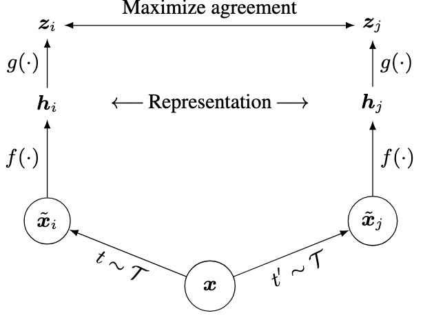

# Contrastive Learning 
self supervised learning technique to learn without labels.
ref: https://arxiv.org/pdf/2002.05709

## Key Takeaways

1. Composition of data augmentation plays a critical role in defining effective predictive tasks.
    - Augmentation selection is critical and defines what the model is learning
2. Introducing a learnable non-linear transformation between the representations and the contrastive loss substancially improces the quality of learned representations. 
    - The encoder's embeddings should be followed by a non-linear transformation (1-layer MLP) and the contrastive loss should be applied to the transformed embeddings, but after training the MLP projection should be removed.*
3. Contrastive learning benifits from large batch size and more training epochs, compare to supervised learning. Just like supervised learning contrastive learning also benifits from larger (deeper and wider) models.
    - Batch sizes of 256 or even higher batch size like 1256 can be used with LARS (layerwise adaptive rate scaling), which is a large batch optimization technique.
4. Contrastive loss uses global **Batch Normalization** (by aggregating BN mean and variance over all devices during the training) instead of BN mean and variance aggregation locally per device.
    - Alternate to this can be using Layer Normalization to avoid having to aggregating BN mean and variance and allowing faster training with large batch size.

Composition of multiple data augmentation operations is cruical in defining the contrastive prediction tasks that yield effective representation. In addition unsupervised contrastive learning benefits from stronger data augmentations than supervised learning.

A learnable non-linear transformation (MLP) between the representation and the contrastive loss substantially improves the quality of learned representations. But it is the embeddings without the non-linear transformation that learns more information and the encoder after removing the non-linear trasnformation should be used for fine-tuning and other tasks.

Representation learning with contrastive cross entropy loss benefits from "normalized embeddings" and an appropriately adjusted temperature ($\tau$) parameter. The temperature in *NT-Xent* (the normalized temperature-scaled cross entropy loss) which is the contrastive loss controls how much emphasis should be given to hard negative pairs. A small temperature means more emphasis to hard negative pairs is given and the model tries to not have any negative pair with high similarity and vice-versa.

After self-supervised training $g(.)$ should be removed and only $f(.)$ should be used for downstream tasks as it hold more information.

*NT-Xent* loss for a positive pair is defined as:
$$
l_{i,j} = − \text{log}\frac{\text{exp}(\text{sim}(z_i, z_j)/\tau )}{\sum_{k=1}^N \mathbb{1}_{k \neq 1} \text{sim}(z_i, z_k)/\tau}
$$
Intution behind the loss, given a positive pair $x_i$, $x_j$ in $\{x_k\}$, contrastive loss aims to identify $x_j$ given $x_i$ in $\{x_k\}_{k\neq i}$.

The contrstive loss includes both the orders of each $\mathcal{L} = l(i,j) + l(j,i)$, the loss is calculated for both directions of the positive pair, ensuring symmetry in the optimization process.

Strong color augmentations (high amount of color jitter and high amount of gaussian blur), are useful in learning more meaningful representations.