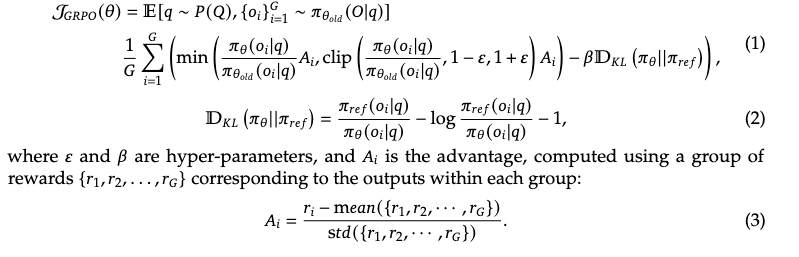

ref: https://arxiv.org/pdf/2501.12948

# Deep Seek R1 model

**Previous work has heavily relied on large amounts of supervised data to enhance model performance. In this study, we demonstrate that reasoning capabilities can be significantly improved through large-scale reinforcement learning (RL), even without using supervised fine-tuning (SFT) as a cold start**

### Post-Training: Large-Scale Reinforcement Learning on the Base Model
- We directly apply RL to the base model without relying on supervised fine-tuning (SFT) as a preliminary step. This approach allows the model to explore chain-of-thought (CoT) for solving complex problems, resulting in the development of DeepSeek-R1-Zero. DeepSeek-R1-Zero demonstrates capabilities such as self-verification, reflection, and generating long CoTs, marking a significant milestone for the research community. Notably, it is the first open research to validate that reasoning capabilities of LLMs can be incentivized purely through RL, without the need for SFT. This breakthrough paves the way for future advancements in this area.

- We introduce our pipeline to develop DeepSeek-R1. The pipeline incorporates two RL stages aimed at discovering improved reasoning patterns and aligning with human preferences, as well as two SFT stages that serve as the seed for the model’s reasoning and non-reasoning capabilities. We believe the pipeline will benefit the industry by creating better models.

### Distillation: Smaller Models Can Be Powerful Too
- We demonstrate that the reasoning patterns of larger models can be distilled into smaller
models, resulting in better performance compared to the reasoning patterns discovered through RL on small models. The open source DeepSeek-R1, as well as its API, will benefit the research community to distill better smaller models in the future.
- Using the reasoning data generated by DeepSeek-R1, we fine-tuned several dense models that are widely used in the research community. The evaluation results demonstrate that the distilled smaller dense models perform exceptionally well on benchmarks. DeepSeek-R1-Distill-Qwen-7B achieves 55.5% on AIME 2024, surpassing QwQ-32B-Preview. Additionally, DeepSeek-R1-Distill-Qwen-32B scores 72.6% on AIME 2024, 94.3% on MATH-500, and 57.2% on LiveCodeBench. These results significantly outperform previous open-source models and are comparable to o1-mini. We open-source distilled 1.5B, 7B, 8B, 14B, 32B, and 70B checkpoints based on Qwen2.5 and Llama3 series to the community.

## Reasoning capabilities without any supervised data

#### Group Relative Policy Optimization
In order to save the training costs of RL, we adopt Group Relative Policy Optimization (GRPO), which foregoes the critic model that is typically the same size as the policy model, and estimates the baseline from group scores instead. Specifically, for each question $q$, GRPO samples a group of outputs ${o1, o2, ... , oG}$ from the old policy $\pi_{\theta_{old}}$ and then optimizes the policy model $\pi_\theta$ by maximizing the following objective:

$A_i$ estimating reward for output corresponding within each group

A problem can have multiple ways of arriving at solutions, to take that into account different output-groups represent different approaches with reward prioritizing correctly answered easiest approaches. But in their reward modelling they just enforce the answer reward and with some thinking process reward by ensuring that the model put its thinking process between the `<think>` tags.

#### Reward Modeling
The reward is the source of the training signal, which decides the optimization direction of RL.

To train DeepSeek-R1-Zero, we adopt a rule-based reward system that mainly consists of two types of rewards:
- **Accuracy rewards**: The accuracy reward model evaluates whether the response is correct. For example, in the case of math problems with deterministic results, the model is required to provide the final answer in a specified format (e.g., within a box), enabling reliable rule-based verification of correctness. Similarly, for LeetCode problems, a compiler can be used to generate feedback based on predefined test cases.
- **Format rewards**: In addition to the accuracy reward model, we employ a format reward
model that enforces the model to put its thinking process between ‘<think>’ and ‘</think>’ tags. 

We do not apply the outcome or process neural reward model in developing DeepSeek-R1-Zero, because we find that the neural reward model may suffer from reward hacking in the large-scale reinforcement learning process, and retraining the reward model needs additional training resources and it complicates the whole training pipeline.

Need to read it again still a lot of intersting things in the paper like DeepSeek-V3 as a generative reward model !! 