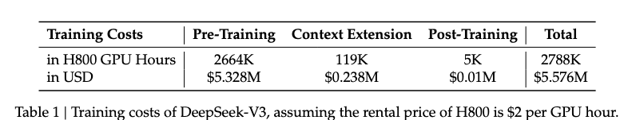

ref: https://nn.labml.ai/transformers/rope/index.html
# Deep Seek v3 model

A traditional DL model is trained to be an expert of all the topics (i.e. Jack of all trades), this needs us to use the entire model weights for a forward pass to make predictions leading to very high inference GPU load and cost.

To deal with this DeepSeek-v3 traines the model in a Mixture-of-Experts (MoE) language model with 671B total parameters, with 37B activated weights for each token. DeepSeek-V3 still adopts Multi-head Latent Attention (MLA) [MLA is a variation of Multi Head Attention (MHA) where key-values has some caching of values during generation resulting in quicker inference and maintaining comparable performance to MHA] or efficient inference and DeepSeekMoE for cost-effective training. All the matrix multiplication for MLA in Section 2.1.1 of reference.

### Training Efficiency

#### Loss and easy inference
DeepSeek-V3 pioneers an `auxiliary-loss-free` strategy for load balancing (between all the experts), with the aim of minimizing the adverse impact on model performance that arises from the effort to encourage load balancing. Secondly, DeepSeek-V3 employs a multi-token prediction training objective, which we have observed to enhance the overall performance on evaluation benchmarks.

#### Mixed precision training and reducing communication
In order to achieve efficient training, we support the `FP8` mixed precision training and implement comprehensive optimizations for the training framework. Low-precision training has emerged as a promising solution for efficient training, its evolution being closely tied to advancements in hardware capabilities. They introduce an `FP8` mixed precision training framework and, for the first time, validate its effectiveness on an extremely large-scale model. 

Through the support for `FP8` computation and storage, they achieve both accelerated training and reduced GPU memory usage. As for the training framework, they design the **DualPipe** algorithm for efficient pipeline parallelism, which has fewer pipeline bubbles and hides most of the communication during training through computation-communication overlap. his overlap ensures that, as the model further scales up, as long as we maintain a constant computation-to-communication ratio, we can still employ fine-grained experts across nodes while achieving a near-zero all-to-all communication overhead.

In addition, we also develop efficient cross-node all-to-all communication kernels to fully utilize InfiniBand (IB) and NVLink bandwidths. Furthermore, we meticulously optimize the memory footprint, making it possible to train DeepSeek-V3 without using costly tensor parallelism. Combining these efforts, we achieve high training efficiency.

### Training strategy
During pre-training, we train DeepSeek-V3 on 14.8T high-quality and diverse tokens. The pre-training process is remarkably stable. Throughout the entire training process, we did not encounter any irrecoverable loss spikes or have to roll back. Next, we conduct a two-stage context length extension for DeepSeek-V3. In the first stage, the maximum context length is extended to 32K, and in the second stage, it is further extended to 128K. Following this, we conduct post-training, including Supervised Fine-Tuning (SFT) and Reinforcement Learning (RL) on the base model of DeepSeek-V3, to align it with human preferences and further unlock its potential. During the post-training stage, we distill the reasoning capability from the DeepSeek-R1 series of models, and meanwhile carefully maintain the balance between model accuracy and generation length.

A few shared expert weights alongside routed experts (router has sigmoid activation for each expert with top $\mathbf{N_T}$ experts activated based on router) which are activated based on router's output. More about RoPE (rotary position embeddings) is here, https://nn.labml.ai/transformers/rope/index.html.

Everything after pre-training was always affordable but needs high-quality supervised data.

#### Architecture: Innovative Load Balancing Strategy and Training Objective
- On top of the efficient architecture of DeepSeek-V2, we pioneer an auxiliary-loss-free strategy for load balancing, which minimizes the performance degradation that arises from encouraging load balancing.

> Router adds a bias for each expert that bias is increased by a hyper-parameter $\gamma$ if the corresponding expert is underloaded and is deacreased by $\gamma$ if the corresponding expert is overloaded. The hyper-parameter $\gamma$ is called as **bias update speed**. Bias is only used for gating the and only the router score is used for the next step expert output.

> Alongside routing the loss is also computed sequence wise a contemproray sequence wise balanced loss is used for this purpose, $\mathbb{1}(.)$ denotes the indicator function; and $T$ denotes the number of tokens
in a sequence

- We investigate a Multi-Token Prediction (MTP) objective and prove it beneficial to model performance. It can also be used for speculative decoding for inference acceleration.

#### Pre-Training: Towards Ultimate Training Efficiency
- We design an FP8 mixed precision training framework and, for the first time, validate the
feasibility and effectiveness of FP8 training on an extremely large-scale model.
- Through the co-design of algorithms, frameworks, and hardware, we overcome the
communication bottleneck in cross-node MoE training, achieving near-full computation-
communication overlap. This significantly enhances our training efficiency and reduces the
training costs, enabling us to further scale up the model size without additional overhead.
- At an economical cost of only 2.664M H800 GPU hours, we complete the pre-training of
DeepSeek-V3 on 14.8T tokens, producing the currently strongest open-source base model.
The subsequent training stages after pre-training require only 0.1M GPU hours.

#### Post-Training: Knowledge Distillation from DeepSeek-R1
- We introduce an innovative methodology to distill reasoning capabilities from the long-
Chain-of-Thought (CoT) model, specifically from one of the DeepSeek R1 series models, into standard LLMs, particularly DeepSeek-V3. Our pipeline elegantly incorporates the verification and reflection patterns of R1 into DeepSeek-V3 and notably improves its reasoning performance. Meanwhile, we also maintain control over the output style and
length of DeepSeek-V3.

Multi-Token Prediction implementation for inferencing

All the mix-precision operations 

Alongside this they also use fine-grained quantization method to mitigate quantization errors caused by feature outliers.

Need to read it again still a lot of intersting things in the paper like DeepSeek-V3 as a generative reward model !! 